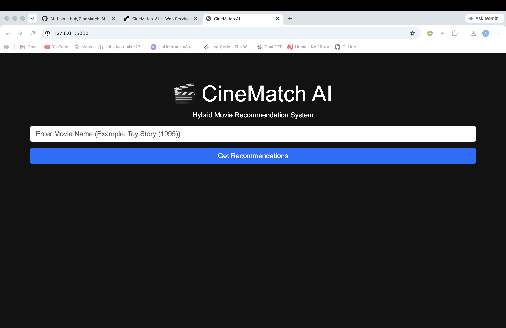
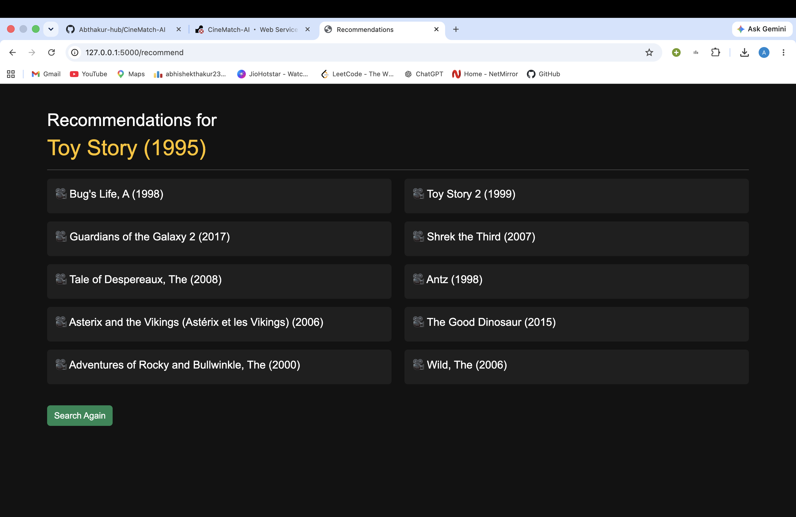

# 🎬 CineMatch AI - Hybrid Movie Recommendation System

---

## 👨‍💻 Author

**Abhishek Thakur**

---

An AI-powered Movie Recommendation System built using **Flask**, **Scikit-learn**, **TF-IDF Vectorization**, and **K-Nearest Neighbors (KNN)**. The application recommends similar movies based on genres and user-generated tags from the MovieLens dataset.

---

## 🚀 Live Demo

**Render:** https://cinematch-ai-fyg5.onrender.com

---

## 📂 GitHub Repository

https://github.com/Abthakur-hub/CineMatch-AI

---

## 📌 Features

- 🎬 Search for a movie by title
- 🤖 AI-powered movie recommendations
- 📚 Content-Based Recommendation System
- 🔍 TF-IDF Vectorization
- 📊 K-Nearest Neighbors (KNN)
- ⚡ Fast recommendation generation
- 🌐 Responsive Flask web application
- 🚀 Deployed on Render

---

## 🛠️ Tech Stack

### Backend
- Python
- Flask

### Machine Learning
- Scikit-learn
- TF-IDF Vectorizer
- Nearest Neighbors (KNN)

### Data Processing
- Pandas
- NumPy

### Frontend
- HTML
- CSS
- Bootstrap 5

### Deployment
- Render
- Gunicorn

---

## 📁 Project Structure

```
CineMatch-AI/
│
├── app.py
├── recommendation.py
├── train.py
├── test.py
├── requirements.txt
├── runtime.txt
├── Procfile
├── README.md
├── .gitignore
│
├── data/
│   ├── movies.csv
│   ├── ratings.csv
│   ├── tags.csv
│   └── links.csv
│
├── models/
│   ├── movies.pkl
│   ├── tfidf.pkl
│   └── knn_model.pkl
│
├── templates/
│   ├── index.html
│   └── result.html
│
└── static/
    └── css/
        └── style.css
```

---

## 📊 Dataset

This project uses the **MovieLens Latest Small Dataset**.

- 9,742 Movies
- 100,836 Ratings
- 3,600+ User Tags

Dataset:
https://grouplens.org/datasets/movielens/latest/

---

## ⚙️ Installation

### Clone the Repository

```bash
git clone https://github.com/Abthakur-hub/CineMatch-AI.git
cd CineMatch-AI
```

### Create Virtual Environment

```bash
python -m venv venv
```

### Activate Virtual Environment

#### macOS/Linux

```bash
source venv/bin/activate
```

#### Windows

```bash
venv\Scripts\activate
```

### Install Dependencies

```bash
pip install -r requirements.txt
```

---

## ▶️ Train the Model

```bash
python train.py
```

This generates:

- movies.pkl
- tfidf.pkl
- knn_model.pkl

---

## ▶️ Run the Application

```bash
python app.py
```

Open your browser and visit:

```
http://127.0.0.1:5000
```

---

## 🧠 How It Works

1. Load MovieLens dataset.
2. Merge movie genres and tags.
3. Create textual movie representations.
4. Convert text into numerical features using TF-IDF.
5. Train a K-Nearest Neighbors (KNN) model.
6. Find the nearest movies based on cosine similarity.
7. Display recommendations through a Flask web application.

---

## 📸 Screenshots

### Home Page



### Recommendation Results



---

## 🎯 Future Improvements

- Movie posters using TMDB API
- Search autocomplete
- Fuzzy movie search
- User authentication
- Personalized recommendations
- Hybrid recommendation using collaborative filtering
- Top-rated and trending movie sections

---

## ⭐ If you found this project useful, please consider giving it a Star!